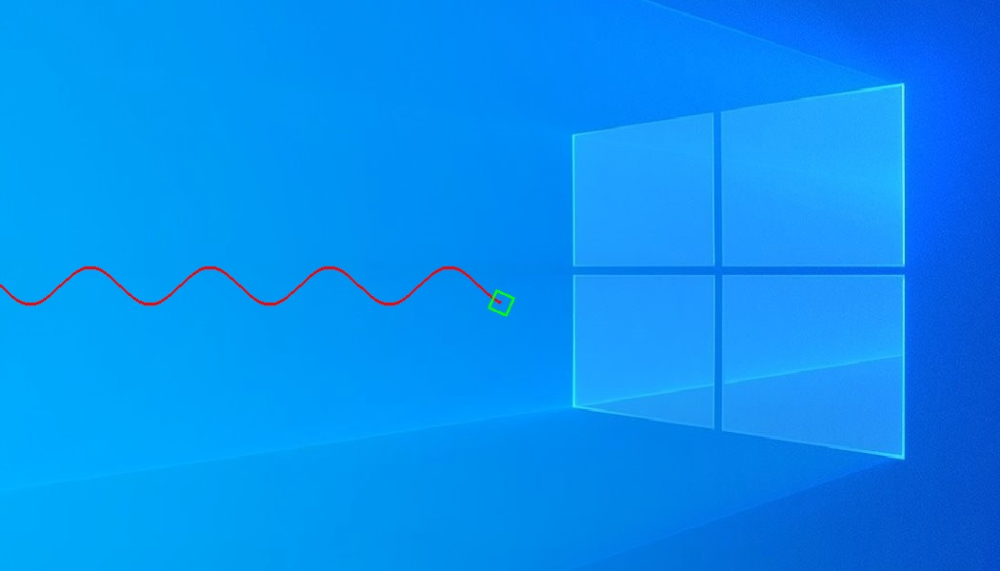
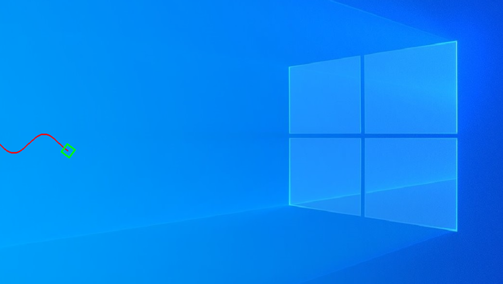
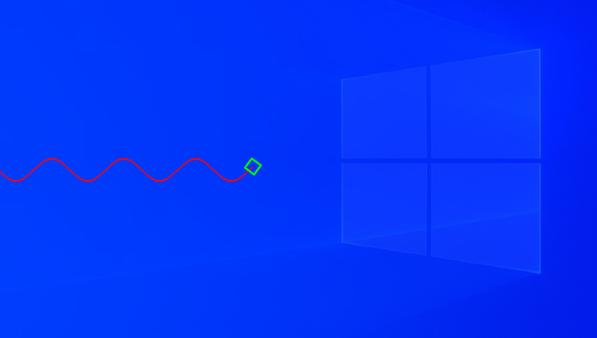

# Задание

Необходимо создать программу, которая выводила бы анимацию движения робота телеги (нарисовать вид сверху схематично) по синусоиде или косинусоиде (зависит от чётности варианта). Траекторию также необходимо нарисовать. Фон для данной анимации необходимо загрузить из какого-либо файла(любой). Когда робот будет на середине экрана, то необходимо сохранить изображение в файл встроенными средствами OpenCV.

Дополнительные задание (на выбору):

1.	Создать игру "танчики", в которой загружаемый из файла танк (картинка) двигалась бы по нажатию клавиш с клавиатуры и могла бы выпускать условный снаряд
2.	Задача о движении 3х тел: нарисовать как будут двигаться 3 тела, обладающие массой в 2х мерном пространстве под действием взаимных сил притяжения. Характеристики тел и вычислений смаштабировать для наглядности.
3.	Придумать и отобразить свой клеточный автомат. Проинтерпретировать получившуюся эволюционную динамику.
4.	Написать свою программу, которая берет на вход два изображения и смешивает их с задаваемым коэффициентом. Под смешиванием понимается blending, заключающийся в сложении интенсивностей пикселей двух изображений по правилу 
 
# Отчет


Для реализации анимации движения робота по синусоиде изображение каждый раз перестраивается, формируя кадр, соответствующий своему времени. Для этого синусоида отстраивается с помощью функции `circle` до определенной координаты х, а модель робота (которая представляет собой вращающийся прямоугольник `RotatedRect`) помещается в конец синусоиды и поворачивается в соответствии с касательной к синусоиде.

Робот начинает движение слева из середины изображения по высоте. В середине по ширине программа заканчивает работу и сохраняет снимок:



В качестве доп задания выбрано задание №4, работа которого совмещена с работой осовного задания и заключается в смешивании изображений для фона. Для этого используется функция:
```
void add_weighted(cv::Mat &src1, cv::Mat &src2, double alpha, cv::Mat &dst) {

    int num_rows = src1.rows;
    int num_cols = src1.cols *  src1.channels();

    for(int i = 0; i < num_rows; ++i) {
        auto src1_p = src1.ptr<uchar>(i);
        auto src2_p = src2.ptr<uchar>(i);
        auto dst_p = dst.ptr<uchar>(i);
        for (int j = 0; j < num_cols; ++j) {
            dst_p[j] = static_cast<int>(src1_p[j] * alpha + src2_p[j] * (1 - alpha));
        }
    }
}
```

Смешивание главного фона (изображение заставки windows) и дополнительного (синий фон) происходит с коэффициентом, зависящим высоты робота в синусоиде:


 