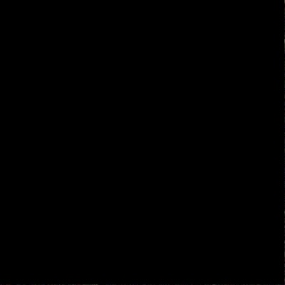
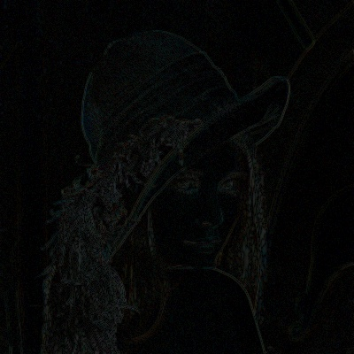
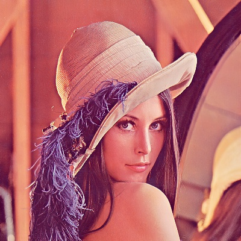
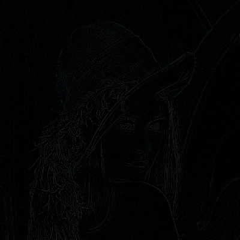
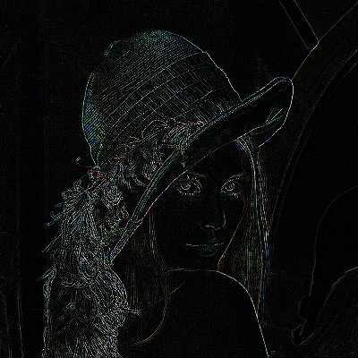
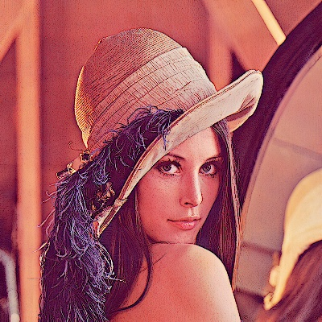
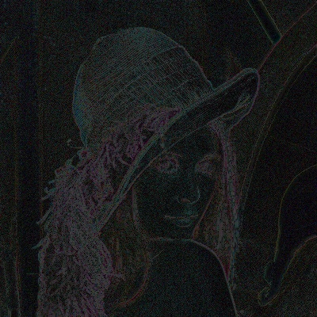
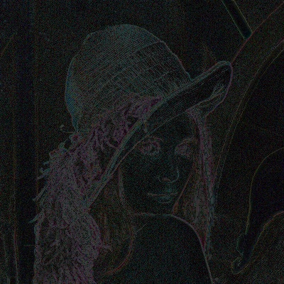

# Задание
1.	Создать отдельную функцию, которая бы сглаживала одноканальное изображение при помощи фильтра по среднему значению пикселей внутри ядра размером 3х3 (в лекциях обозначен как box filter). Для этого рекомендуется использовать ОИ. Функция вычисления, однако, должна иметь возможность менять размер окна
2.	Проверить правильную работу созданной функции при помощи функции из OpenCV void blur(InputArray src, OutputArray dst, Size ksize). Для этого необходимо программно сравнить изображения, проверяя равенство каждого пикселя одного изображения другому пикселю. Для этого рекомендуется использовать способ The Core Function из ранее приведённой ссылки.  Вывести значение их схожести в виде процентов. Если схожесть 98%-100%, то твоя функция работает исправно. Отличие в немного % может объясняться тем, что вы не обработали рамку по краям изображения. Иногда эту рамку оставляют (как в нашем простом случае), иногда обрабатывают, достраивая дополнительные пиксели или беря их с других участков изображения. Необходимо вывести оба изображения.

3.	Измерить время работы каждой функции и вывести его в консоль. Вывести результат измерений 

4.	Отфильтровать изображение функцией Гаусса и сравнить результат с box filter. Субъективно оценить качество изображения. Вывести оба изображения и сравнить их путем наложения и вывода разности двух фильтраций. Улучшить отображение выведенной разницы применив логарифмическое преобразование изображений.

5.	Реализовать unsharp mask с фильтром Гаусса и Box фильтром. Оба фильтра необходимо применить с одинаковым коэффициентом резкости (см. выше). Сравнить оба изображения путем наложения и вывода разностного изображения.

6.	Реализовать фильтр Лапласа (руками, свой). Вывести результат. 

7.	Реализовать unsharp mask с фильтром Лапласа. Вывести результат и сравнить с п.5.

# Отчет

Исходное изображение - lenna.png. Фильтрация изображения происходит с помощью функций, которые оборачивают функцию `filter_2D_int32`:
```
void filter2D_int32(cv::Mat &src, cv::Mat &dst, cv::Mat &kernel);
```
В ней для каждого пикселя исходного изображения вызывается следующая функция:
```
void convolve(cv::Mat &src, cv::Mat &dst, cv::Mat &kernel, int x, int y);
```
В ней вычисляется новое, свернутое значение пикселя на основе ядра свертки `kernel`. Для нахождения участка изображения для свертки используется обращение к ROI в функции:
```
cv::Mat get_roi_with_border_reflect101(cv::Mat &src, int x, int y, cv::Size ksize);
```
Когда ROI взять невозможно возле границы, то находятся донорные пиксели, потому что для обработки границ выбран тип BORDER_REFLECT101. Индексы этих пикселей находятся с помощью функции:
```
int find_reflected101_index(int orig_idx, int boundary_idx);
``` 
Все функции, использующие обход пикселей изображения, использует обход с помощью указателей. Например, так:
```
for (int y = 0; y < img1.rows; y++) {
        auto p1 = img1.ptr<uchar>(y);
        auto p2 = img2.ptr<uchar>(y);

        for (int x = 0; x < img1.cols; x++) {
            for (int channel = 0; channel < num_of_channels; channel++) {
                auto value1 = p1[x * num_of_channels + channel];
                auto value2 = p2[x * num_of_channels + channel];
                if (value1 == value2) {
                    sum_of_matches++;
                }
            }
        }
    }
``` 

Результаты работы программы.

1.	Работа собственной функции box-фильтра 3х3

<div align="center">
  
 <br/>
 img
</div>

<div align="center">
  
 <br/>
 custom_blur_img
</div>

2.	Проверка работы фильтра сглаживания (схожесть: 99.731%)

<div align="center">
  
 <br/>
 opencv_blur_img
</div>

<div align="center">
  
 <br/>
 custom_blur_img
</div>

<div align="center">
  
 <br/>
 blur_diff_img
</div>

3.	Время работы:

Custom blur ticks: 1885289

OpenCV blur ticks: 2637 

4.	Сравнение сглаживания по Гауссу и Box фильтра.

<div align="center">
  
 <br/>
 opencv_blur_img
</div>

<div align="center">
  
 <br/>
 opencv_gaussian_blur_img
</div>

<div align="center">
  
 <br/>
 gaussian_box_diff_img
</div>

5.	Сравнение unsharp mask с фильтром Гаусса и Box фильтром. 

<div align="center">
  
 <br/>
 gauss_unsharp_img
</div>

<div align="center">
  
 <br/>
 box_unsharp_img
</div>

<div align="center">
  
 <br/>
 diff_img
</div>

6.	Фильтр Лапласа.

<div align="center">
  
 <br/>
 laplace_img
</div>
 
7.	Unsharp mask с фильтром Лапласа и сравнение с п.5.

<div align="center">
  
 <br/>
 laplace_unsharp_img
</div>

<div align="center">
  
 <br/>
 box_laplace_diff_img
</div>

<div align="center">
  
 <br/>
 gauss_laplace_diff_img
</div>
