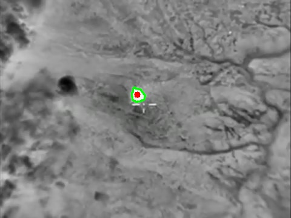
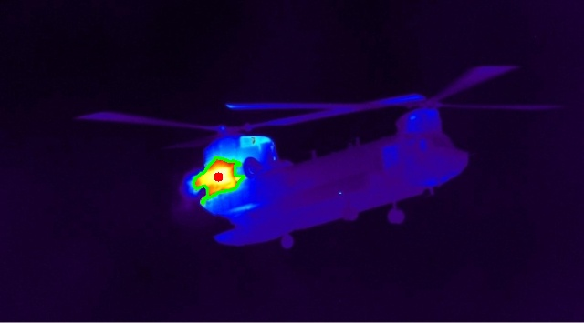
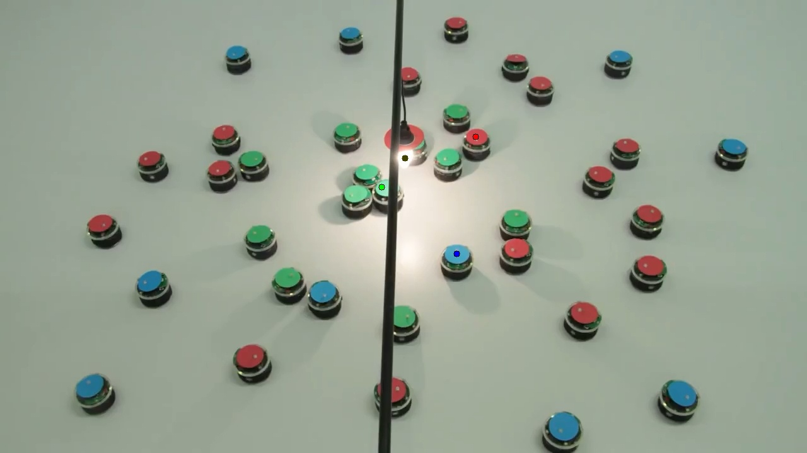
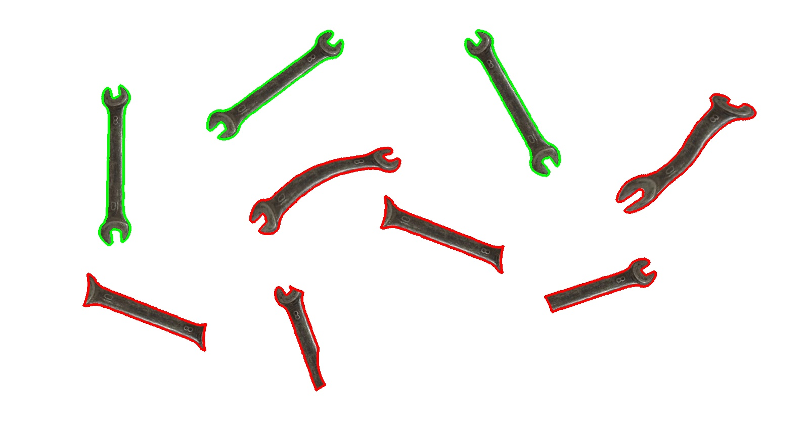

# Задание

1.	«Товарищ!!! Помоги пилоту бомбардировщика найти демократически умеренных жителей с автоматами при помощи тепловизора. Известно, что они любят прятаться в уютных тёплых домиках (которые заметно теплее всего остального) и там же делать свои тёмные делишки. Чтобы пилоту было удобнее навестись тебе надо обозначить примерный центр цели на изображении». См. картинки в папке «allababah».
2.	«Товарищ! Родина не ждёт! Тебя отправили работать в сверхсекретное КБ, где тебе поручили разработать сверхсекретную систему сверхсекретного наведения на забугорные транспортные средства, которые желают принести нам демократию. Твоя задача - точно навести сверхсекретную пушку на тёпленькое моторное отделение». См. картинки в папке «teplovizor».
3.	«В том же секретном КБ тебе поручили следить за особыми экспериментальными роботами, которые любят погреться под лампочкой. Твоя задача: 
    1)	На каждом роботе найти его цветную верхнюю крышку и обвести контуром цвета его команды;
    2)	Найти лампу, обозначить её как-нибудь.
    3)	Для каждой команды обозначить ближайшего робота к лампе, путём рисования его центра масс.»

    См. картинки в папке «roboti».

4.	А теперь тебе поручили разработать систему ТЗ по отбраковке гаечных ключей для сборки тех роботов. Обозначь бракованные и правильные гаечные ключи разными метками.  См. картинки в папке «gk».

# Отчет

Для решения заданий созданы вспомогательные функции.

Функция `std::vector<Area> get_area_centers(cv::Mat &img, cv::Mat &mask, cv::Scalar lower, cv::Scalar upper, double contour_area_thresh)` находит контуры объектов на изображении, отфильтрованном в пространстве HSV с границами lower и upper. Функция возвращает вектор объектов структуры Area, который содержит контур объекта и его центр.

Функция `void draw_ares_centers(cv::Mat &img, std::vector<Area> areas)` отрисовывает найденные области.

Функция `cv::Point find_lamp_center(cv::Mat &img, cv::Scalar lamp_lower, cv::Scalar lamp_upper);` находит центр лампы с помощью маски в HSV.

## Задание 1

С помощью описанных ранее вспомогательных фунций находятся контуры ярких областей с помошью фильтрации по HSV и отрисовывются границей и центром.

  

## Задание 2

С помощью описанных ранее вспомогательных фунций находятся контуры красных областей с помошью фильтрации по HSV и отрисовывются красным центром.

  

## Задание 3

Сначала находится центр лампы по характерному цвету. Затем область вокруг лампы закрашивается черным прямоугольником, чтобы она не мешала при нахождении роботов.

Далее для каждой команды находятся их роботы с помощью фильтрации в HSV, после чего по эвклидову расстоянию находятся ближайшие к лампе.

  

# Задание 4

Сначала изображения с ключами создается маска, по которой находятся контуры объектов. Затем находится контур эталонного ключа как максимальный контур на изображении. После чего происходит сравнение контуров исходного изображения с образцом.

При сравнении отбрасываются слишком маленькие контуры. После чего контуры сравниваются с помощью функции `cv::matchShapes`. Эта функция выдает значение, по которому определяется соответствие контуров. Если это ниже экспериментально определенного порогового значения (0.2), то контур считается небракованным и рисуется зеленым, иначе - рисуется красным

  

