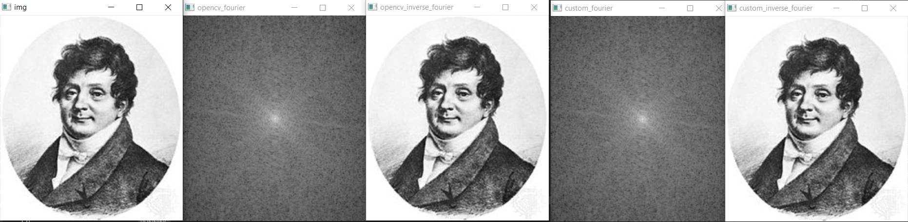
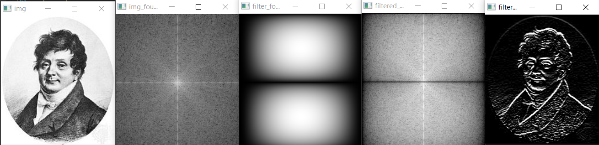
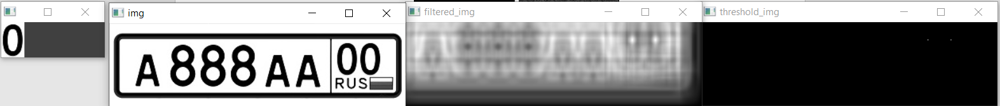

# Задание

1.	Написать свою функцию преобразования Фурье (прямое и обратное) используя «лобовой подход».
2.	Написать преобразование Фурье используя алгоритм Radix-2 (по основанию 2, или «Бабочка») 
3.	Сравнить быстродействие из функций из первой и второй части, а также с преобразованием из OpenCV
4.	Произвести по отдельности свёртку какого-либо изображения  с ядром фильтров: Собеля (по горизонтали и вертикали), усредняющего (BoxFilter), Лапласа. Необходимо «красиво» вывести магнитуду образа Фурье исходного изображения и ядра свёртки.
Полученные образы Фурье в результате выполнения свёртки следует обратно преобразовать в изображение. Сначала обрезаем полученное изображение (при помощи ROI) до первоначального размера. Полученное изображение нормализуем (с теми же параметрами, как и в примере, приведённом в теории) и выводим.
5.	Взять какое-нибудь изображение и в его спектре обрезать в одном случае элементы спектра с высокими частотами, в другом – низкими. А потом выполнить обратное преобразование на основе полученных спектров.
6.	Провести корреляцию (сравнение) изображений автомобильных номеров по очереди с 3-мя символами. Полученный образ Фурье обратно преобразовать в обычное изображение. Найти на нём наибольшее значение, которое принимают элементы. Отнять от этого значения небольшое число (около 0.01). Использовать полученное число в качестве порога для пороговой фильтрации от полученного изображения.

# Отчет

## Задание 1

Для реализации прямого метода DFT созданы функции `dft1D` и `dft2D`. 
`dft1D` принимает объект Mat, в котором только одна строка или только один столбец.
На выходе получается результат применения прямого DFT - объект класса Mat c таким же размером, как и входной массив.
Число каналов и применение обратного преобразования определяется параметром `flags`.

Сам же алгоритм преобразования представляет собой вычисление матрицы коэффициентов W и матричное умножение с входным вектором.
Для вычисления коэффициентов W создана вспомогательная функция `calcDftCoef`. Так же одним из параметров функции является `w` - 
подсчитанная заранее матрица коэффициентов, которая для оптимизации может передаваться из функции `dft2D`, о которой написано далее.

Для двумерного преобразования Фурье создана функция `dft2D`. Эта функция имеет аналогичные параметры, за исключением `w`.
В ней происходит одномерное преобразование Фурье сначала по строкам, затем по столбцам. Для строк и столбцов для оптимизации
заранее посчитаны 2 матрицы коэффициентов W.

В функции `task_1` произведено сравнение описанного метода с методом из OpenCV. Результаты для одного из изображений показаны ниже:

  

## Задание 2

Для реализации FFT созданы функции `fft1D` и `fft2D`. 
`fft1D` принимает объект Mat, в котором только одна строка или только один столбец.
На выходе получается результат применения прямого DFT - объект класса Mat c таким же размером, как и входной массив.
Число каналов и применение обратного преобразования определяется параметром `flags`.

Алгоритм преобразования представляет собой 
достраивание изображения до размеров степени двойки, 
перестановка входных значений в двоично-инверсном порядке,
выполнение алгоритма бабочки. 
Коэффициенты для бабочки вычисляются последовательным домножением на соответствующее число.   

Для двумерного преобразования Фурье создана функция `fft2D`. Эта функция имеет аналогичные параметры.
В ней происходит одномерное преобразование Фурье сначала по строкам, затем по столбцам.

В функции `task_2` произведено сравнение описанного метода с методом из OpenCV. Результаты для одного из изображений показаны ниже:

  

## Задание 3

Для определения веремни работы использовался класс TickMeter. 
Для одного из изображений в функции `task_3` получились следующие результаты сравнения:

OpenCV dft ticks: 1903500
Custom dft ticks: 140751100
Custom fft ticks: 54619100

## Задание 4

Для выполнения сверки ядром фильтра и вывода результата создана вспомогательная функция `mulSpectrumShow`.
В ней происходит расширение изображения до нужного размера, применение dft, умножение спектров функцией `mulSpectrum`,
обратное преобразование и обрезка до исходного размера. 

В функции `task_4` произведена свертка для указанных в задании ядер фильтров. 
Результаты для одного из изображений показаны ниже:

  

  

  

  

## Задание 5

Для обрезки низких частот на образе Фурье с измененными квадрантами в центре нарисована черная окружность.
Для обрезки высоких частот от исходного образа отнят образ без низких частот.
Для обратного преобразования квадранты возвращены на исходные места.

В функции `task_5` произведена обрезка спектра. 
Результаты для одного из изображений показаны ниже:

  

## Задание 6

Для нахождения корреляции использовалась функция `mulSpectrums` с параметром conjB = true.
После этого произведено обратное преобразование и обрезка образа корреляции.
По максимальному значению корреляции определился порог, по которому произведена фильтрация для поиска найденных шаблонов.

В функции `task_6` произведено нахождение корреляции. 
Результаты для всех шаблонов показаны ниже:

  

  

  

